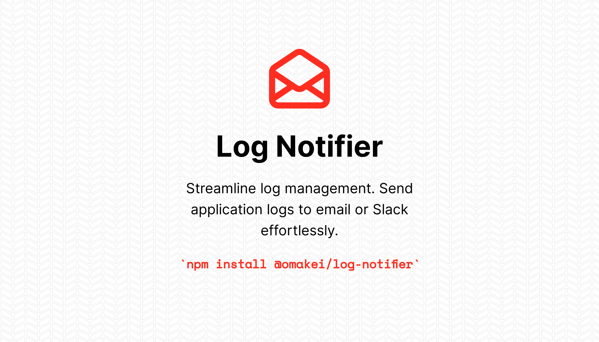

<div align="center">
  
</div>


<div align="center">
  <h2><b>Log Notifier</b></h2>
  <p>Streamline log management. Send application logs to email or Slack effortlessly.</p>
</div>

<div align="center">

[![npm-image]][npm-url] [![license-image]][license-url] [![typescript-image]][typescript-url]

</div>


## **Pre-requisites**
The `@omakei/log-notifier` package requires `@adonisjs/core >= 5.8.5` with `@adonisjs/mail>= 8.2.1`

## **Installation**

Make sure to install and configure `@adonisjs/mail` beforehand if you are using mail to receive log notification, by running the following commands:

```ts
npm i @adonisjs/mail

# or

yarn add @adonisjs/mail


node ace configure @adonisjs/mail

```

Install the package from the npm registry as follows.

```
npm i @omakei/log-notifier

# or

yarn add @omakei/log-notifier

```

Next, configure the package by running the following ace command.

```
node ace configure @omakei/log-notifier

```

After that, add this to your `config/app.ts` in the logger configuration section. 
```ts
export const logger: LoggerConfig = {
  //Add this property
  stream: {
    write: (msg: string) => {
      Application.container.resolveBinding('Omakei/LogNotifier').write(msg)
      console.log(msg)
    },
  },
}
```

Open the `env.ts` file and define validate the environment 
variables based upon the drivers you are using

### Variables for the log notifier package

```ts

SLACK_WEBHOOK: Env.schema.string()
SLACK_CHANNEL: Env.schema.string()
SLACK_ICON_URL: Env.schema.string()
SLACK_USERNAME: Env.schema.string()
SMTP_FROM: Env.schema.string()

```
Then add thier value to `.env` file.
```ts
SLACK_WEBHOOK=
SLACK_CHANNEL=
SLACK_ICON_EMOJI=
SLACK_ICON_URL=
SLACK_USERNAME=
SMTP_FROM=

```
Now you can run your application and start recieve log to the your prefired channel in the `config/log_notifier.ts` file.
## Testing

```bash
npm run test
```


## Changelog

Please see [CHANGELOG](CHANGELOG.md) for more information on what has changed recently.

## Contributing

Please see [CONTRIBUTING](https://github.com/omakei/.github/blob/main/CONTRIBUTING.md) for details.

## Security Vulnerabilities

Please review [our security policy](../../security/policy) on how to report security vulnerabilities.

## Credits

- [omakei](https://github.com/omakei)
- [All Contributors](../../contributors)

## License

The MIT License (MIT). Please see [License File](LICENSE.md) for more information.

[npm-image]: https://img.shields.io/npm/v/@omakei/log-notifier.svg?style=for-the-badge&logo=npm
[npm-url]: https://npmjs.org/package/@omakei/log-notifier "npm"

[license-image]: https://img.shields.io/npm/l/@omakei/log-notifier?color=blueviolet&style=for-the-badge
[license-url]: LICENSE.md "license"

[typescript-image]: https://img.shields.io/badge/Typescript-294E80.svg?style=for-the-badge&logo=typescript
[typescript-url]:  "typescript"