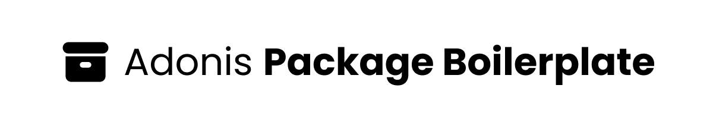

<div align="center">
  
</div>


<div align="center">
  <h2><b>Adonis Package Boilerplate</b></h2>
  <p>A easy way to create AdonisJS packages</p>
</div>

## **Usage**

1. Press the "Use this template" button at the top of this page to create a new repository with the contents of this template.
2. Install the required dependencies using your preferred package manager
```bash
npm install
yarn install
pnpm install
```
3. Run the configuration script using your preferred package manager
```bash
npm run configure
yarn configure
pnpm configure
```
## **Folder Structure**

### **adonis-typings**
In this folder is where the types of your project will stay for example the ambient module for custom name space of your classes.

### **bin**
In this folder is where the binaries of your package will stay.

### **commands**
In this folder is where the command classes of your package will stay.

### **providers**
In this folder is where the service provider classes of your package will stay.

### **src**
In this folder is where the source code of your package will stay.

### **templates**
In this folder is where the source code of your package will stay.

#### **instructions**
In this file is where the instructions for your package will stay.